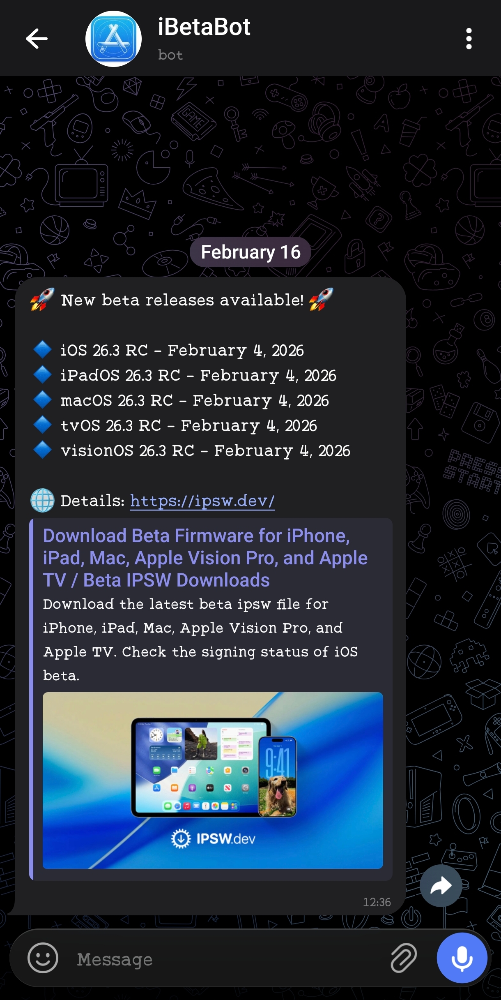

# 🤖 iBetaBot

**iBetaBot** is a lightweight automation bot designed to monitor the latest Apple beta and Release Candidate firmware, including **iOS, iPadOS, macOS, tvOS, and visionOS**.

    

The bot periodically fetches data from **IPSW.dev**, detects newly published builds, and sends structured notifications to a specified **Telegram chat**. To prevent duplicate alerts, it persists the last known release state and only reports changes when new versions appear. Once per day it also sends a short heartbeat message so you know it's still running even when nothing new has shipped.

Built for reliability and low operational overhead, iBetaBot is **cron-ready**, dependency-minimal, and ideal for developers, testers, and Apple platform enthusiasts who want timely beta release intelligence without manual tracking.

## Running via GitHub Actions

The included [`.github/workflows/ibeta_bot.yml`](.github/workflows/ibeta_bot.yml) runs the bot every 30 minutes on GitHub's infrastructure, so it keeps checking even when your own machine is off or asleep. The workflow commits `ibeta_last_state.txt` and `ibeta_heartbeat_state.txt` back to the repo after each run so state survives between the ephemeral runners.

To enable it, add two repository secrets under **Settings → Secrets and variables → Actions**:

- `TELEGRAM_TOKEN` — your bot token
- `CHAT_ID` — the target chat ID

You can also trigger a run manually from the **Actions** tab (`workflow_dispatch`).
