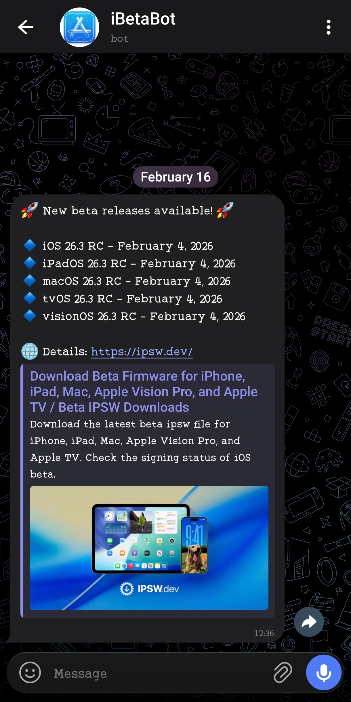

# ⚡ iBetaBot

**Real-time Apple beta & RC firmware watchdog — iOS, iPadOS, macOS, tvOS & visionOS builds pushed straight to Telegram the moment they drop.**

[](https://github.com/pi0trdotsys/iBetaBot/actions/workflows/ibeta_bot.yml)
[](https://github.com/pi0trdotsys/iBetaBot/actions/workflows/tests.yml)
[](https://www.python.org/)
[](LICENSE)
[](https://github.com/pi0trdotsys/iBetaBot/commits/main)

<div align="center">
    
</div>

## Why iBetaBot

No refreshing IPSW.dev, no missed builds, no noise. iBetaBot watches Apple's beta pipeline for you and only speaks up when something actually changes — cron-ready, dependency-light, and running for free on GitHub's own infrastructure.

- 🔭 **Continuous monitoring** — scrapes [IPSW.dev](https://ipsw.dev/) on a 30-minute schedule for new iOS, iPadOS, macOS, tvOS, visionOS, and audioOS builds.
- 🎯 **Signal, not spam** — tracks the *full* set of known releases (not just the page's first entry), so a new build is never missed just because it isn't listed first, and notifications call out only what's actually new instead of resending the whole listing every time; a transient page hiccup gets one retry before it's ever treated as a real break.
- 💬 **Readable Telegram alerts** — releases are grouped by version, bolded, and monospaced instead of dumped as a flat list.
- 🧭 **Public Beta context** — every alert includes a historical note on when the Public Beta typically follows a given Developer Beta.
- 💓 **Daily heartbeat** — one quiet ping every day confirms the bot is alive even when nothing new has shipped.
- ☁️ **Zero-maintenance hosting** — runs on GitHub Actions, so it keeps working while your machine is off or asleep.

## How it works

1. Fetches the latest builds from IPSW.dev.
2. Compares them against the full set of previously known releases (`ibeta_last_state.txt`).
3. On any genuinely new release, sends a Telegram message naming just what's new and updates the state.
4. Once per UTC day, sends a heartbeat regardless of whether anything changed.

## Running via GitHub Actions (recommended)

The included [`.github/workflows/ibeta_bot.yml`](.github/workflows/ibeta_bot.yml) runs the bot every 30 minutes on GitHub's infrastructure — no server, no always-on laptop required. It commits `ibeta_last_state.txt` and `ibeta_heartbeat_state.txt` back to the repo after each run so state survives between the ephemeral runners.

To enable it, add two repository secrets under **Settings → Secrets and variables → Actions**:

| Secret | Description |
|---|---|
| `TELEGRAM_TOKEN` | Your bot token from [@BotFather](https://t.me/BotFather) |
| `CHAT_ID` | The target chat ID to notify |

You can also trigger a run on demand from the **Actions** tab (`workflow_dispatch`).

## Running locally

```bash
git clone https://github.com/pi0trdotsys/iBetaBot.git
cd iBetaBot
pip install -r requirements.txt

# create a .env file with:
# TELEGRAM_TOKEN=your-bot-token
# CHAT_ID=your-chat-id

python ibeta_bot.py
```

Pair it with your own cron/launchd schedule if you'd rather self-host than use GitHub Actions.

## Testing

```bash
pip install -r requirements-dev.txt
pytest -v
```

The [`tests/`](tests/) suite covers state persistence, the retry/parse-error handling, heartbeat cadence, and — as a standing regression test — the exact duplicate-announcement bug that once shipped in production. A separate [`.github/workflows/tests.yml`](.github/workflows/tests.yml) runs it on every push and pull request, independent of the bot's own scheduled workflow.

## License

[MIT](LICENSE) © Piotr Rosiński
